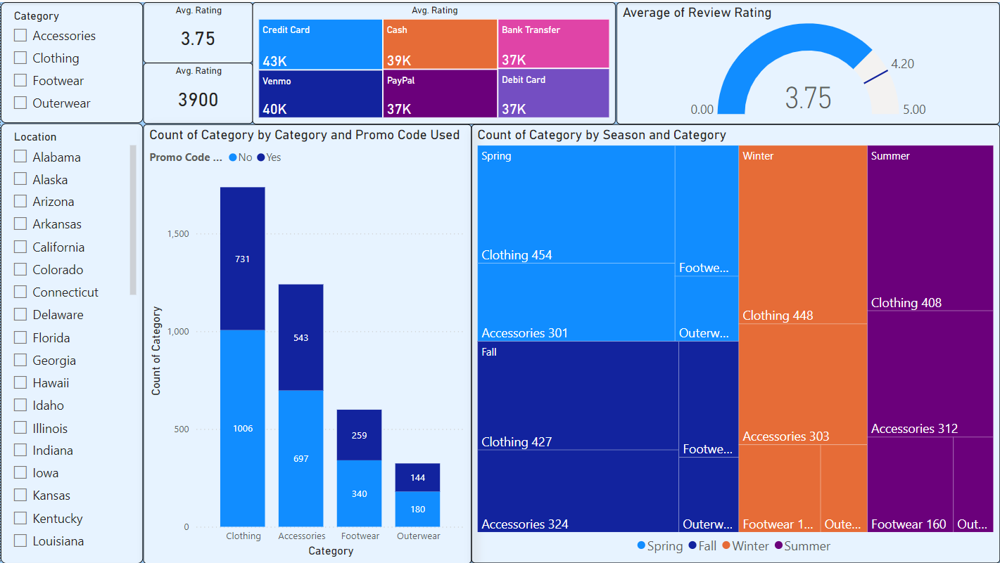

<!-- File: README.md -->

# Shopping Trend Dashboard 📊

**Hello Readers**  
I sourced the `shopping_trends.csv` dataset, cleaned the data in Power BI, and built an interactive dashboard. Below is a preview of the final report:



---

## 🔍 About

This project explores shopping trends by analyzing daily sales data across categories. The Power BI dashboard highlights:

- Overall and category-wise revenue  
- Time-series trends (daily, weekly, monthly)  
- Top-performing categories and items  
- Seasonal or promotional spikes  

---

## 📂 Data Source

- **File:** `shopping_trends.csv`  
- **Description:** Daily transactional records including customer demographics, item details, sales amount, and metadata.

---

## 🗂 Data Dictionary for `shopping_trends.csv`

| Column Name               | Data Type | Description                                                            |
|---------------------------|-----------|------------------------------------------------------------------------|
| Customer ID               | Integer   | Unique identifier for each customer                                    |
| Age                       | Integer   | Customer’s age in years                                                |
| Gender                    | String    | Customer’s gender (e.g., “Male”, “Female”)                             |
| Item Purchased            | String    | Name of the item purchased (e.g., “T-shirt”, “Jeans”)                  |
| Category                  | String    | Product category (e.g., “Clothing”, “Electronics”, “Home”)             |
| Purchase Amount (USD)     | Integer   | Amount paid in U.S. dollars                                            |
| Location                  | String    | Customer’s location (state, region, or city)                           |
| Size                      | String    | Size of the item (e.g., “S”, “M”, “L”, “XL”)                           |
| Color                     | String    | Color of the purchased item (e.g., “Gray”, “Maroon”)                   |
| Season                    | String    | Season of purchase (e.g., “Winter”, “Spring”, “Summer”, “Fall”)        |
| Review Rating             | Float     | Customer’s review rating on a 1.0–5.0 scale                            |
| Subscription Status       | String    | Whether the customer has an active subscription (“Yes” or “No”)        |
| Payment Method            | String    | Payment method used (e.g., “Credit Card”, “Cash”, “Venmo”)             |
| Shipping Type             | String    | Delivery option selected (e.g., “Express”, “Free Shipping”)            |
| Discount Applied          | String    | Whether a discount was applied (“Yes” or “No”)                         |
| Promo Code Used           | String    | Whether a promo code was used (“Yes” or “No”)                          |
| Previous Purchases        | Integer   | Number of past purchases by this customer                              |
| Preferred Payment Method  | String    | Customer’s preferred payment channel (e.g., “Credit Card”, “Venmo”)    |
| Frequency of Purchases    | String    | Typical purchase cadence (e.g., “Weekly”, “Fortnightly”, “Monthly”)    |


---

## 🚀 Usage

1. **Clone the repo**  
   ```bash
   git clone https://github.com/karan2958/shopping_trend.git
   cd shopping_trend
